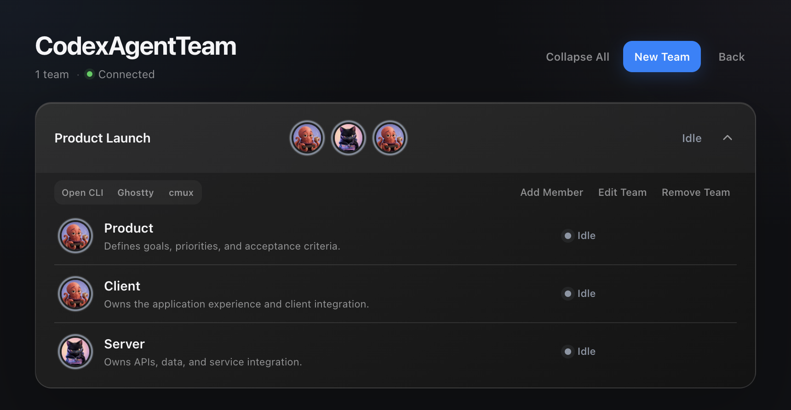
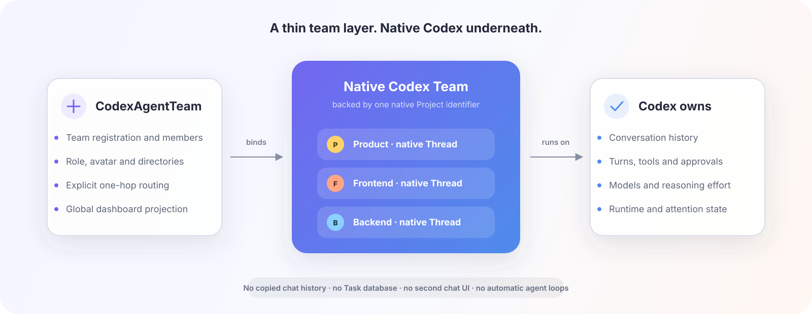

<div align="center">

# CodexAgentTeam

### A persistent team of native Codex conversations.

Create specialists once. See the whole team, enter any original conversation, and let members collaborate without replacing Codex.

[](https://github.com/zyfn/codex-agent-team/actions/workflows/ci.yml)
[](./LICENSE)


[简体中文](./README.zh-CN.md) · [Changelog](./CHANGELOG.md) · [Contributing](./CONTRIBUTING.md) · [Support](./SUPPORT.md) · [Security](./SECURITY.md)

</div>

One Codex conversation is easy to manage. A group of specialists is not: roles get repeated, context spreads across tabs, working directories collide, and checking every conversation becomes its own job.

CodexAgentTeam organizes native Codex conversations into durable teams. Each member keeps an identity, responsibility, avatar, independent directory, and original Thread. A global Dashboard shows the team and opens the real conversation when judgment is needed.

> [!IMPORTANT]
> CodexAgentTeam is an experimental macOS preview. Native Threads and App Server events remain authoritative; the global Desktop entry currently depends on a small, fail-closed CDP adapter.



## What you get

| | Capability | Practical result |
| --- | --- | --- |
| **01** | Persistent members | Define a specialist once and continue the same native Thread tomorrow. |
| **02** | One team view | See every Team, member, and Codex attention state without opening each chat. |
| **03** | Original conversations | Click a member to use Codex's own history, tools, approvals, and navigation. |
| **04** | Explicit collaboration | Submit one bounded message to one teammate through the native Thread—no custom queue, broadcast, or agent loop. |
| **05** | Safe member directories | Start empty, create a local Git worktree, or clone a remote Git repository into a Team-owned directory. |

## Quick start

### Requirements

- macOS
- Node.js 22+
- Git
- Codex Desktop installed at `/Applications/Codex.app`

### Install

```sh
codex plugin marketplace add zyfn/codex-agent-team
codex plugin add codex-agent-team@codex-agent-team
```

Restart Codex and create a new conversation so the plugin Skills are discovered.

### Launch CodexAgentTeam

Invoke `$codex-agent-team:launch` and ask to launch CodexAgentTeam. The Skill performs compatibility checks, then starts a separate Codex window with a **CodexAgentTeam** entry in its global navigation. Your current Codex is never closed or restarted by the plugin.

Once the CodexAgentTeam window is ready, use **Command-Q** to quit the current ordinary Codex and continue in CodexAgentTeam. Closing the CodexAgentTeam Codex with **Command-Q** ends its temporary official App Server and releases its member Threads. Teams, member directories, and native Threads remain available the next time you open CodexAgentTeam or ordinary Codex.

### Create a Team

1. Open **CodexAgentTeam** from the global navigation.
2. Create a Team.
3. Add members with a name, responsibility, avatar, initial model settings, and an optional Git source.
4. Click a member to enter its original Codex conversation.

Member creation primes the new Thread once with its identity and collaboration rules, so later work does not need to rediscover the Team setup.

Inside a member conversation, `$codex-agent-team:collaborate` can return the member's complete Team context in one call and send one explicit message to one teammate.

Each Team has a user-visible `shared` directory for durable documents. Members use normal file tools there and send the absolute file path only when another teammate needs the document.

## A real workflow

```text
Create “Release”
  ├─ Product  · clarifies the goal and acceptance
  ├─ Backend  · owns service behavior
  ├─ Frontend · owns the user flow
  └─ QA       · verifies the result

Open Product and provide the goal
  → Product explicitly contacts Backend and Frontend
  → Dashboard reflects native Codex running / waiting / idle state
  → Enter any member's original conversation when a decision is needed
  → Ask QA to verify the delivered result in its own persistent Thread
```

The roles are examples, not a built-in workflow. The same model works for research, content, operations, or any work that benefits from long-lived specialists.

## The model



- **One Team** is backed by one native Codex Project; `teamId` is that native identifier.
- **One member** maps to one persistent native Thread and one Team-owned Member Directory. That directory is empty, a local Git worktree, or a remote Git clone.
- **One collaboration** is one explicit message to one target member.
- **One Dashboard** projects Codex state; it does not create a second source of truth.

There is no Task database, Leader lifecycle, copied conversation history, custom App Server, or second chat UI.

Codex owns the backing Project identity and display name. CodexAgentTeam stores only `teamId`, one stable Team Directory, and minimal member identity metadata. Opening the Dashboard reads the current Team name, member cwd, and runtime state from Codex; it does not persist duplicate native state.

## Native by design

| CodexAgentTeam owns | Codex owns |
| --- | --- |
| Team registration and member metadata | Team identity, name, appearance, and roots |
| Responsibilities and avatars | Thread history and storage |
| Team and Member Directory preparation | Turns, tools, and approvals |
| Explicit teammate routing | Models and reasoning behavior |
| Dashboard projection | Runtime state, conversation rendering, and navigation |

CodexAgentTeam does not modify Codex SQLite, rollout files, `config.toml`, authentication, or Thread data formats. Removing a member archives its native conversation and preserves every Member Directory and Git branch.

## Optional terminal view

From the Dashboard, open a Team in **Ghostty** or **cmux**. CodexAgentTeam resumes the same native member Threads in one tab or workspace with split panes and member titles. This is another view over the Team, not another session model.

## Safety and compatibility

- Without a Git source, CodexAgentTeam creates an empty Member Directory named after the member under the Team Directory.
- A selected local source must be a Git repository; CodexAgentTeam creates an isolated worktree in the Member Directory and never works directly in the source checkout.
- A remote Git URL is cloned into the Member Directory.
- Model and reasoning choices are used only when the native Thread is created. Codex owns subsequent changes together with the Thread cwd.
- Removing a member archives its native Thread but never deletes its directory, worktree, branch, or avatar file.
- Each run owns one temporary official Codex App Server and never touches the user's shared daemon.
- The CodexAgentTeam Desktop uses an isolated Electron profile, so it can start without taking over the ordinary Codex window.
- Closing the CodexAgentTeam Desktop ends its owned App Server; attached terminal views disconnect with that run.
- Ports and connection waits are bounded; CodexAgentTeam does not install a startup job or intercept future Codex launches.
- Desktop integration fails closed when a required private capability changes.

Read [SECURITY.md](./SECURITY.md) for the trust boundary, [SUPPORT.md](./SUPPORT.md) for the compatibility promise and issue checklist, and [ASSETS.md](./ASSETS.md) for media licensing.

## Data and uninstall

CodexAgentTeam stores Team registration, avatars, Member Directories, and bounded runtime diagnostics under `~/.codex-agent-team/`. Removing the plugin does not delete this directory or native Codex conversations. Quit an active CodexAgentTeam window with **Command-Q** before uninstalling, then remove retained data manually only when you no longer need it.

## Development

`plugins/codex-agent-team/` is the only installable runtime source.

```sh
npm test
npm run check
python3 /path/to/plugin-creator/scripts/validate_plugin.py plugins/codex-agent-team
```

Lifecycle or CDP changes require real Codex Desktop validation in addition to automated tests. See [CONTRIBUTING.md](./CONTRIBUTING.md).

## License

[MIT](./LICENSE)
