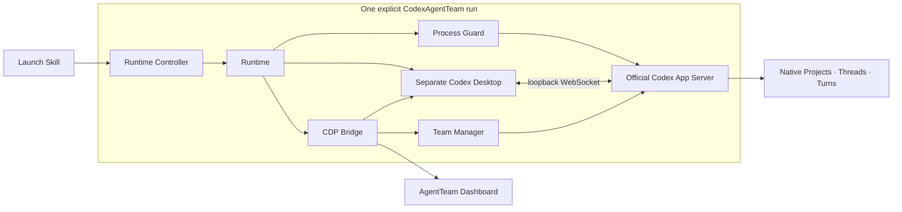

<div align="center">

# CodexAgentTeam

### A persistent team of native Codex conversations.

Create specialists once. See the whole team, enter any original conversation, and let members collaborate without replacing Codex.

[](https://github.com/zyfn/codex-agent-team/actions/workflows/ci.yml)
[](./LICENSE)


[简体中文](./README.zh-CN.md) · [Changelog](./CHANGELOG.md) · [Contributing](./CONTRIBUTING.md) · [Support](./SUPPORT.md) · [Security](./SECURITY.md)

</div>

One Codex conversation is easy to manage. A group of specialists is not: roles get repeated, context spreads across tabs, working directories collide, and checking every conversation becomes its own job.

CodexAgentTeam organizes native Codex conversations into durable teams. Each member keeps one original Thread, a user-defined responsibility, an avatar, and a working directory owned by that Thread. A global Dashboard shows the team and opens the real conversation when judgment is needed.

> [!IMPORTANT]
> CodexAgentTeam is an experimental macOS preview. Native Threads and App Server events remain authoritative; the global Desktop entry currently depends on a small, fail-closed CDP adapter.


## What you get

| | Capability | Practical result |
| --- | --- | --- |
| **01** | Persistent members | Define a specialist once and continue the same native Thread tomorrow. |
| **02** | One team view | See every Team, member, and Codex attention state without opening each chat. |
| **03** | Original conversations | Click a member to use Codex's own history, tools, approvals, and navigation. |
| **04** | Native collaboration | Contact another member through its native Thread without leaving the Team workflow. |
| **05** | Safe member directories | Start empty, create a local Git worktree, or clone a remote Git repository into a Team-owned directory. |

## Quick start

### Requirements

- macOS
- Node.js 22+
- Git
- Codex Desktop installed at `/Applications/Codex.app`

### Install

```sh
codex plugin marketplace add zyfn/codex-agent-team
codex plugin add codex-agent-team@codex-agent-team
```

Restart Codex and create a new conversation so the plugin Skills are discovered.

### Launch CodexAgentTeam

Invoke `$codex-agent-team:launch` and ask to launch CodexAgentTeam. The Skill performs compatibility checks, then starts a separate Codex window with an **AgentTeam** entry in its global navigation. Your current Codex is never closed or restarted by the plugin.

Once the CodexAgentTeam window is ready, use **Command-Q** to quit the current ordinary Codex and continue in CodexAgentTeam. Closing the CodexAgentTeam Codex with **Command-Q** ends its temporary official App Server and releases its member Threads. Teams, member directories, and native Threads remain available the next time you open CodexAgentTeam or ordinary Codex.

### Create a Team

1. Open **AgentTeam** from the global navigation.
2. Create a Team.
3. Add members with a name, responsibility, avatar, initial model settings, and working files from an empty folder, local Git worktree, or remote clone.
4. Click a member to enter its original Codex conversation.

Member creation primes the new Thread with its identity, responsibility, and working directory, so later work does not need to rediscover the Team setup.

Inside a member conversation, `$codex-agent-team:collaborate` can inspect the current Team, contact a teammate, or reply to an incoming Team message. Ordinary Codex conversations cannot send Team messages.

Each Team has a user-visible `shared` directory for durable documents. Members use normal file tools there and send the absolute file path only when another teammate needs the document.

## How it works



1. Launch verifies the installed Codex CLI, Desktop, App Server transport, native Project methods, and Desktop integration anchor.
2. One Runtime starts one guarded official App Server and one separate Codex Desktop on dynamic loopback ports.
3. The Team Manager uses native Projects, Threads, and Turns. App Server events update the Dashboard; no conversation state is copied.
4. CDP adds the global AgentTeam entry and calls native navigation. If Codex changes a required private capability, the run fails closed.
5. Closing the separate Desktop stops only that run. Team registration, working files, and native Threads remain.

One Team is one native Codex Project; one member is one persistent native Thread. Member names are Thread display names, never routing or filesystem identities. Collaboration identifies the sender from native Thread metadata, resolves a target only inside the same Team, and submits one native Turn. There is no Task database, copied history, custom App Server, or second chat UI.

## Optional terminal view

Choose **Ghostty** or **cmux** from a Team header to resume the same member Threads in one native split layout. Missing applications are disabled; no cmux control-socket setting is required.

## Safety and compatibility

- Local Git sources become isolated worktrees; remote Git sources are cloned; no source checkout is modified directly.
- Codex owns Thread history, cwd, models, Turns, tools, and approvals. AgentTeam stores only Team registration and member metadata.
- Removing a member archives its Thread and preserves working files. Removing the plugin also preserves native Threads and `~/.codex-agent-team/`.
- AgentTeam never edits Codex SQLite, rollout files, `config.toml`, authentication, or Thread formats.
- The global Desktop entry depends on private Codex capabilities and is therefore an experimental, fail-closed macOS integration.

Read [SECURITY.md](./SECURITY.md) for the trust boundary, [SUPPORT.md](./SUPPORT.md) for the compatibility promise and issue checklist, and [ASSETS.md](./ASSETS.md) for media licensing.

## Development

`plugins/codex-agent-team/` is the only installable source. Team data and custom avatars live under `~/.codex-agent-team/`.

```sh
npm test
npm run check
python3 /path/to/plugin-creator/scripts/validate_plugin.py plugins/codex-agent-team
```

Lifecycle or CDP changes require real Codex Desktop validation in addition to automated tests. See [CONTRIBUTING.md](./CONTRIBUTING.md).

## License

[MIT](./LICENSE)
