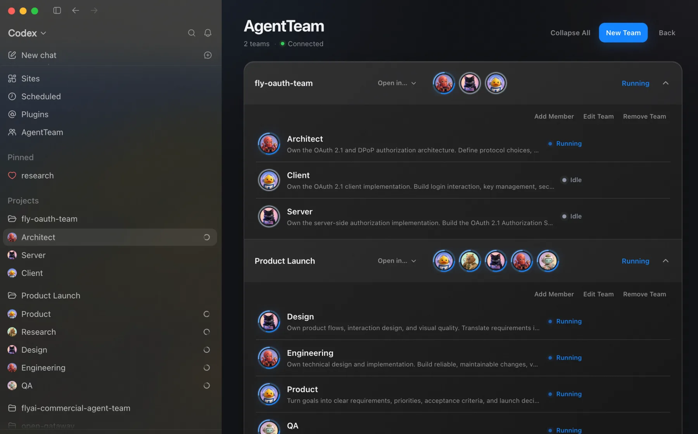
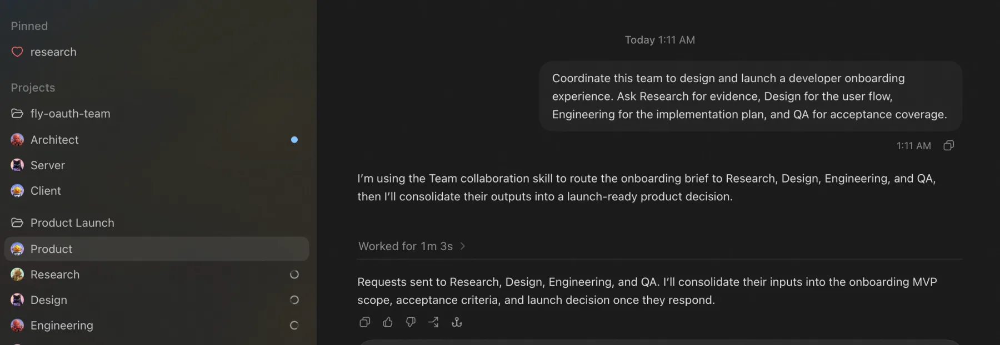
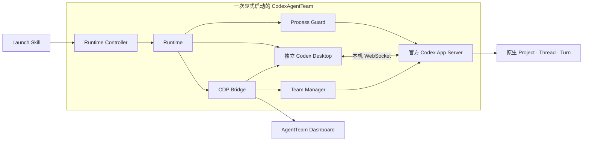

<div align="center">

# CodexAgentTeam

### 一支由原生 Codex 会话组成的持久团队。

专家只创建一次。全局查看整支团队，进入任意原始会话，让成员协作，同时不替代 Codex。

[](https://github.com/zyfn/codex-agent-team/actions/workflows/ci.yml)
[](./LICENSE)


[English](./README.md) · [更新记录](./CHANGELOG.md) · [参与贡献](./CONTRIBUTING.md) · [支持范围](./SUPPORT.md) · [安全策略](./SECURITY.md)

</div>

管理一段 Codex 会话很容易，管理一组专家却不容易：职责需要反复说明，上下文散落在多个标签页里，工作目录可能互相影响，逐个检查会话本身也变成了一项工作。

CodexAgentTeam 把原生 Codex 会话组织成长期存在的团队。每位成员保留一条原始 Thread、用户定义的职责、头像，以及由该 Thread 持有的工作目录；全局 Dashboard 展示整支团队，并在需要判断时进入真正的会话。

> [!IMPORTANT]
> CodexAgentTeam 当前是 macOS 实验预览版。原生 Thread 与 App Server 事件始终是权威事实；全局 Desktop 入口目前依赖一层很小的、失败关闭的 CDP 适配器。



## 你会得到什么

| | 能力 | 对真实工作的改变 |
| --- | --- | --- |
| **01** | 持久成员 | 专家只定义一次，第二天继续同一条原生 Thread。 |
| **02** | 一个团队视图 | 不逐个打开聊天，也能看到所有 Team、成员和 Codex 待处理状态。 |
| **03** | 原始会话 | 点击成员继续使用 Codex 自己的历史、工具、审批和导航。 |
| **04** | 原生协作 | 在 Team 工作流中直接联系另一位成员，消息进入对方的原生 Thread。 |
| **05** | 安全成员目录 | 从空目录开始、为本地 Git 创建 worktree，或把远程 Git 仓库克隆进 Team 管理的目录。 |

## 快速开始

### 环境要求

- macOS
- Node.js 22+
- Git
- Codex Desktop 安装在 `/Applications/Codex.app`

### 安装

```sh
codex plugin marketplace add zyfn/codex-agent-team
codex plugin add codex-agent-team@codex-agent-team
```

安装后重启 Codex，并创建一个新会话，让插件 Skills 被发现。

### 启动 CodexAgentTeam

调用 `$codex-agent-team:launch`，要求启动 CodexAgentTeam。Skill 完成兼容性检查后，会启动一个独立 Codex 窗口，并在其全局导航中加入 **AgentTeam** 入口。插件不会关闭或重启当前 Codex。

CodexAgentTeam 窗口准备完成后，使用 **Command-Q** 退出当前普通 Codex，再在 CodexAgentTeam 窗口继续工作。使用 **Command-Q** 退出 CodexAgentTeam Codex 后，本次临时官方 App Server 会结束并释放成员 Thread。Team、成员目录与原生 Thread 会继续保留，下一次可从 CodexAgentTeam 或普通 Codex 中继续。

### 创建 Team

1. 从全局导航打开 **AgentTeam**。
2. 创建一个 Team。
3. 为成员设置名称、职责、头像、初始模型配置，并选择空目录、本地 Git worktree 或远程 clone 作为工作文件。
4. 点击成员，进入它的原始 Codex 会话。

创建成员时，CodexAgentTeam 会向新 Thread 写入身份、职责和工作目录；后续工作不需要重新理解 Team 配置。

在成员会话中，`$codex-agent-team:collaborate` 可以查看当前 Team、联系其他成员，或回复收到的 Team 消息。普通 Codex 会话不能发送 Team 消息。

每个 Team 都有一个用户可见的 `shared` 目录，用于保存持久共享文档。成员直接使用原生文件工具读写；只有其他成员确实需要时，才发送文件绝对路径、用途和期望动作。



## 工作原理



1. 启动前验证 Codex CLI、Desktop、App Server 传输、原生 Project 方法和 Desktop 注入锚点。
2. 一个 Runtime 在动态本机端口启动一个受守护的官方 App Server 和一个独立 Codex Desktop。
3. Team Manager 只调用原生 Project、Thread 与 Turn；Dashboard 根据 App Server 事件更新，不复制会话状态。
4. CDP 只增加全局 AgentTeam 入口并调用原生导航；Codex 私有能力变化时失败关闭。
5. 独立 Desktop 退出后只结束本次运行；Team 注册、工作文件和原生 Thread 继续保留。

一个 Team 对应一个原生 Codex Project，一位成员对应一条持久原生 Thread。成员名称只是 Thread 显示名，不是路由或文件身份。协作从原生 Thread 信息识别发送者，只在同一 Team 内解析目标，并提交一个原生 Turn。系统没有 Task 数据库、聊天记录副本、自定义 App Server 或第二套聊天 UI。

## 可选终端视图

在 Team 标题行选择 **Ghostty** 或 **cmux**，即可把同一批原生成员 Thread 放入原生分屏。未安装应用会置灰，不需要配置 cmux control socket。

## 安全与兼容性

- 本地 Git 来源会创建隔离 worktree，远程 Git 来源会 clone；不会直接修改源 checkout。
- Codex 管理 Thread 历史、cwd、模型、Turn、工具和审批；AgentTeam 只保存 Team 注册与成员元数据。
- 移除成员只归档 Thread 并保留工作文件；卸载插件也不会删除原生 Thread 和 `~/.codex-agent-team/`。
- AgentTeam 不修改 Codex SQLite、rollout、`config.toml`、认证信息或 Thread 格式。
- 全局 Desktop 入口依赖 Codex 私有能力，因此当前仍是失败关闭的 macOS 实验集成。

信任边界见 [SECURITY.md](./SECURITY.md)，兼容承诺与问题清单见 [SUPPORT.md](./SUPPORT.md)，媒体授权见 [ASSETS.md](./ASSETS.md)。

## 开发

`plugins/codex-agent-team/` 是唯一可安装源码；Team 数据和自定义头像位于 `~/.codex-agent-team/`。

```sh
npm test
npm run check
python3 /path/to/plugin-creator/scripts/validate_plugin.py plugins/codex-agent-team
```

生命周期或 CDP 改动除了自动测试，还必须执行真实 Codex Desktop 验收。详见 [CONTRIBUTING.md](./CONTRIBUTING.md)。

## 许可证

[MIT](./LICENSE)
